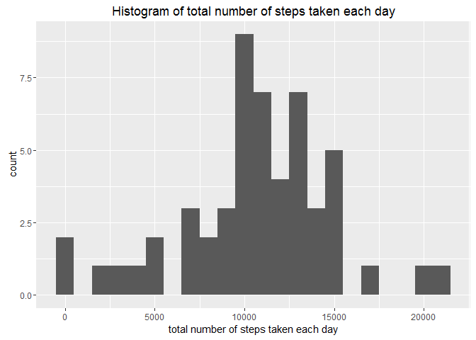
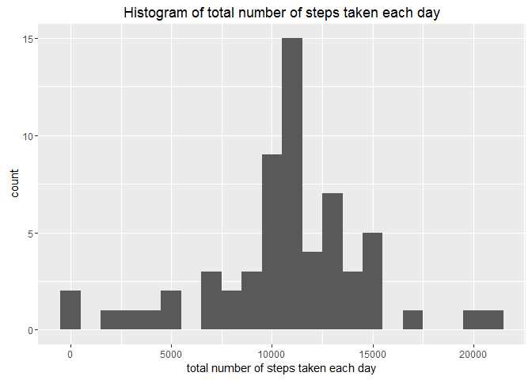
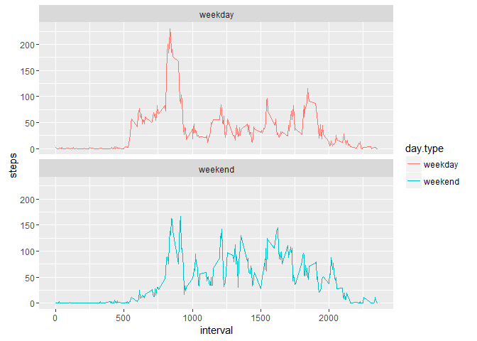

# Course Project 1  

**title:** Reproducible Research: Course Project 1  
**author:** Guang Yang  
**date:** September 18, 2016  
**output:** html_document    

## Introduction  
This assignment makes use of data from a personal activity monitoring device. This device collects data at 5 minute intervals through out the day. The data consists of two months of data from an anonymous individual collected during the months of October and November, 2012 and include the number of steps taken in 5 minute intervals each day.

The data for this assignment can be downloaded from the course web site:

Dataset:[Activity monitoring data](https://d396qusza40orc.cloudfront.net/repdata%2Fdata%2Factivity.zip)  [52K]

The entire assignment is completed in a single R markdown document that can be processed by knitr and be transformed into an HTML file.


## Assignment
### Code for download and unzip data and load library and set options

```r
library(knitr) 
library(ggplot2)
library(dplyr)
```

```
## 
## Attaching package: 'dplyr'
```

```
## The following objects are masked from 'package:stats':
## 
##     filter, lag
```

```
## The following objects are masked from 'package:base':
## 
##     intersect, setdiff, setequal, union
```

```r
options(scipen = 1, digits = 2)

#Download and unzip data#
fileUrl<-"https://d396qusza40orc.cloudfront.net/repdata%2Fdata%2Factivity.zip"
downloadFile <- "./activity.zip"
unzipFile<-"./activity.csv"
download.file(fileUrl, downloadFile)
unzip(downloadFile, overwrite = T)
```

### Loading and preprocessing the data

```r
data <- read.csv("activity.csv", header = TRUE, sep = ',')
data$date<-as.Date(data$date,format = "%Y-%m-%d")
str(data)
```

```
## 'data.frame':	17568 obs. of  3 variables:
##  $ steps   : int  NA NA NA NA NA NA NA NA NA NA ...
##  $ date    : Date, format: "2012-10-01" "2012-10-01" ...
##  $ interval: int  0 5 10 15 20 25 30 35 40 45 ...
```

```r
head(data)
```

```
##   steps       date interval
## 1    NA 2012-10-01        0
## 2    NA 2012-10-01        5
## 3    NA 2012-10-01       10
## 4    NA 2012-10-01       15
## 5    NA 2012-10-01       20
## 6    NA 2012-10-01       25
```
### What is mean total number of steps taken per day?
For this part of the assignment, you can ignore the missing values in the dataset.  

*1. Calculate the total number of steps taken per day*

```r
data.1<-subset(data,!is.na(data$steps))
step.per.day<-aggregate(steps~date, data=data.1, sum)
step.per.day
```

```
##          date steps
## 1  2012-10-02   126
## 2  2012-10-03 11352
## 3  2012-10-04 12116
## 4  2012-10-05 13294
## 5  2012-10-06 15420
## 6  2012-10-07 11015
## 7  2012-10-09 12811
## 8  2012-10-10  9900
## 9  2012-10-11 10304
## 10 2012-10-12 17382
## 11 2012-10-13 12426
## 12 2012-10-14 15098
## 13 2012-10-15 10139
## 14 2012-10-16 15084
## 15 2012-10-17 13452
## 16 2012-10-18 10056
## 17 2012-10-19 11829
## 18 2012-10-20 10395
## 19 2012-10-21  8821
## 20 2012-10-22 13460
## 21 2012-10-23  8918
## 22 2012-10-24  8355
## 23 2012-10-25  2492
## 24 2012-10-26  6778
## 25 2012-10-27 10119
## 26 2012-10-28 11458
## 27 2012-10-29  5018
## 28 2012-10-30  9819
## 29 2012-10-31 15414
## 30 2012-11-02 10600
## 31 2012-11-03 10571
## 32 2012-11-05 10439
## 33 2012-11-06  8334
## 34 2012-11-07 12883
## 35 2012-11-08  3219
## 36 2012-11-11 12608
## 37 2012-11-12 10765
## 38 2012-11-13  7336
## 39 2012-11-15    41
## 40 2012-11-16  5441
## 41 2012-11-17 14339
## 42 2012-11-18 15110
## 43 2012-11-19  8841
## 44 2012-11-20  4472
## 45 2012-11-21 12787
## 46 2012-11-22 20427
## 47 2012-11-23 21194
## 48 2012-11-24 14478
## 49 2012-11-25 11834
## 50 2012-11-26 11162
## 51 2012-11-27 13646
## 52 2012-11-28 10183
## 53 2012-11-29  7047
```

*2. If you do not understand the difference between a histogram and a barplot, research the difference between them. Make a histogram of the total number of steps taken each day*

```r
qplot(step.per.day$steps,binwidth=1000, main = "Histogram of total number of steps taken each day", xlab = "total number of steps taken each day")
```

<!-- -->

*3. Calculate and report the mean and median of the total number of steps taken per day*

```r
mean<-mean(step.per.day$steps)
median<-median(step.per.day$steps)
mean
```

```
## [1] 10766
```

```r
median
```

```
## [1] 10765
```
The mean is 10766.19 and the median is 10765.  

### What is the average daily activity pattern?  
*1. Make a time series plot (i.e. type = "l") of the 5-minute interval (x-axis) and the average number of steps taken, averaged across all days (y-axis)*

```r
step.per.interval<-data.1 %>% group_by(interval) %>% summarize(steps = mean(steps))
ggplot(data=step.per.interval,mapping=aes(x=interval,y=steps))+geom_line()
```

<!-- -->

*2. Which 5-minute interval, on average across all the days in the dataset, contains the maximum number of steps?*

```r
step.max<-step.per.interval[which.max(step.per.interval$steps),]
step.max
```

```
## # A tibble: 1 × 2
##   interval steps
##      <int> <dbl>
## 1      835   206
```
The interval 835, on average across all the days in the dataset, contains the maximum number of steps, 206.17.

### Imputing missing values
Note that there are a number of days/intervals where there are missing values (coded as NA). The presence of missing days may introduce bias into some calculations or summaries of the data.  

*1. Calculate and report the total number of missing values in the dataset (i.e. the total number of rows with NAs)*

```r
total.missing<-sum(is.na(data$steps))
total.missing
```

```
## [1] 2304
```
Total number of missingg values in the dataset is 2304.  

*2. Devise a strategy for filling in all of the missing values in the dataset. The strategy does not need to be sophisticated. For example, you could use the mean/median for that day, or the mean for that 5-minute interval, etc.*  
Use mean for a interval to fill all missing values of that interval  

*3. Create a new dataset that is equal to the original dataset but with the missing data filled in.*

```r
data.full<-data
nas<-is.na(data.full$steps)
avg_interval <- tapply (data.full$steps, data.full$interval, mean, na.rm=TRUE, simplify=TRUE)
data.full$steps[nas]<-avg_interval[as.character(data.full$interval[nas])]
total.missing.impute<-sum(is.na(data.full$steps))
total.missing.impute
```

```
## [1] 0
```
Number of missing values after imputing is 0  

*4. Make a histogram of the total number of steps taken each day and Calculate and report the mean and median total number of steps taken per day. Do these values differ from the estimates from the first part of the assignment? What is the impact of imputing missing data on the estimates of the total daily number of steps?*  
Make a histogram of the total number of steps taken each day

```r
full.step.per.day<-aggregate(steps~date, data=data.full, sum)
qplot(full.step.per.day$steps,binwidth=1000, main = "Histogram of total number of steps taken each day", xlab = "total number of steps taken each day")
```

<!-- -->

Calculate and report the mean and median total number of steps taken per day

```r
full.mean<-mean(full.step.per.day$steps)
full.median<-median(full.step.per.day$steps)
full.mean
```

```
## [1] 10766
```

```r
full.median
```

```
## [1] 10766
```
The mean is 10766.19 and the median is 10766.19. The median value differs from the estimates from the first part of the assignment. The impact is the median value increased to the same value as mean.

### Are there differences in activity patterns between weekdays and weekends?
For this part the weekdays() function may be of some help here. Use the dataset with the filled-in missing values for this part.  

*1. Create a new factor variable in the dataset with two levels - "weekday" and "weekend" indicating whether a given date is a weekday or weekend day.*

```r
data.full<- mutate(data.full, day.type = ifelse(weekdays(data.full$date) %in% c("Saturday","Sunday"), "weekend", "weekday"))

data.full$day.type <- as.factor(data.full$day.type)
```

*2. Make a panel plot containing a time series plot (i.e. type = "l") of the 5-minute interval (x-axis) and the average number of steps taken, averaged across all weekday days or weekend days (y-axis). See the README file in the GitHub repository to see an example of what this plot should look like using simulated data.*

```r
full.step.per.interval<-data.full %>% group_by(interval,day.type) %>% summarize(steps = mean(steps))
ggplot(full.step.per.interval, aes(x=interval, y=steps, color = day.type)) +
  geom_line() +
  facet_wrap(~day.type, ncol = 1, nrow=2)
```

<!-- -->
  
The step level increases earlier during weekdays, but overall it is higher during weekends.
